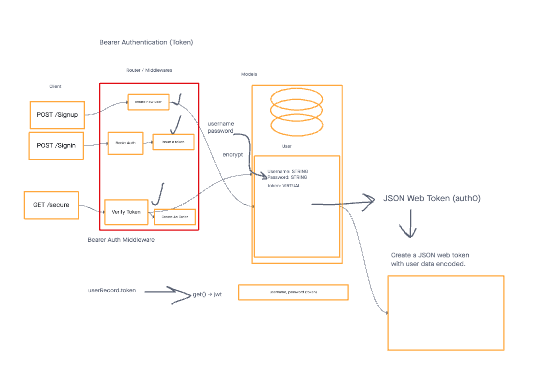

# Bearer Authorization (JWT) Lab

In this lab, we're enhancing our authentication server. We've already got basic authentication (username and password) working, and when a user logs in successfully, we generate a signed JWT "Token" that's sent back to the application. Now, we're taking this Token and using it for continuous authentication, ensuring that only valid users can access protected routes.

Before you start, create a UML diagram to plan your authentication system. Follow the lab instructions for setup, branch creation, code submission, and deployment.

## Business Requirements

Refer to the Authentication System Overview for a detailed view of the application's business and technical requirements.

## Phase 2 Requirements

In this phase, we're adding a new requirement: users who log in with basic authentication should be able to continuously authenticate using a "token." All previous requirements and user stories remain in effect, and this phase builds on our existing authentication server.

Here are the core requirements for this phase:

**Obtain a Token After Sign-In:** After signing in, users should receive a JWT token. This token allows them to re-authenticate.

**Use the Token for Protected Routes:** Users can use their token to access routes that require valid authentication. These routes should function as usual when a valid token is provided. If the token is invalid, show an "Invalid Login" error.

**Enhance Token Security:** Research and implement security measures to make our JWT tokens as secure as possible.

## Technical Notes

Deploy a server that meets the requirements.
Use the provided Express server in the "starter-code" folder.

## Tasks

1. Start by fixing any bugs in the server so it runs smoothly. Tests have been written for you.

2. Implement at least two security measures for JWT tokens to enhance their security. Configure these measures using environment settings for flexibility.

